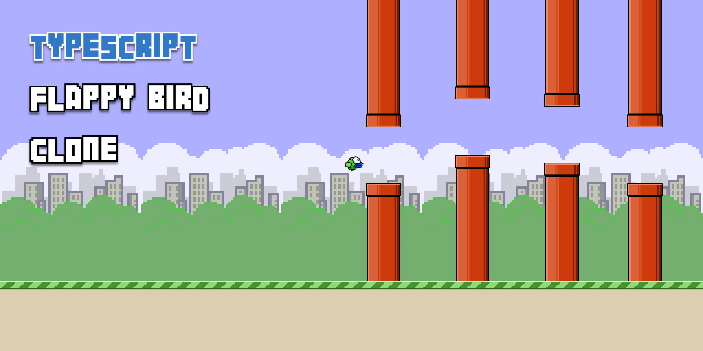
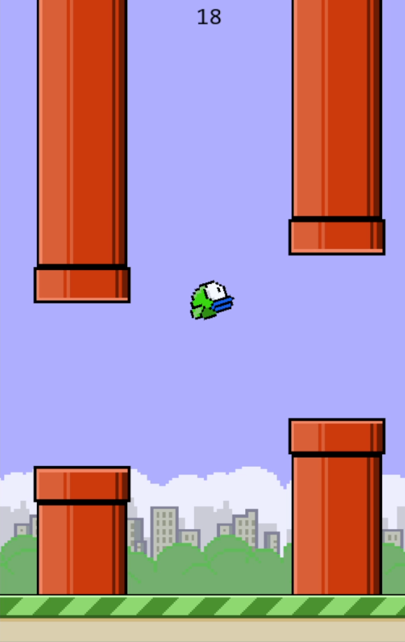
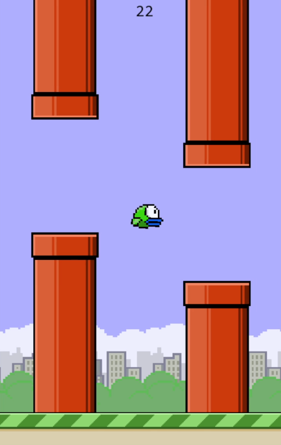
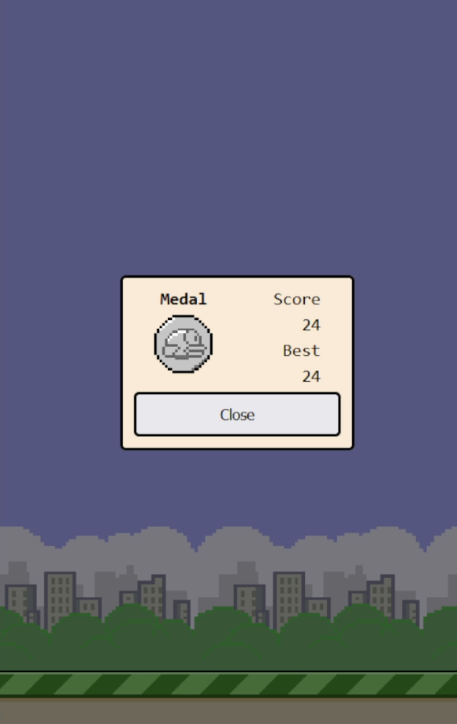

# Typescript Flappy Bird Clone



## Introduction

A Flappy Bird clone game that runs entirely in the browser, powered by the [Canvas API](https://developer.mozilla.org/en-US/docs/Web/API/Canvas_API).\
\
This very simple game uses [Typescript](https://www.typescriptlang.org/) under the hood to ensure type safety and [Webpack](https://webpack.js.org/) for bundling all the source code into a single easily deployable javascript bundle. Asides from code, all game assets including sprites and sound effects were also hand-crafted by the use of online drawing and sound design tools.

## Screenshots





## How to play

### Live Demo

There is a live demo available over at https://luccas-flappy-bird.surge.sh/.
\
Were you able to get all 4 medals?

### Local Setup

To run the game locally from source, in a terminal window clone this repository from github:

```bash
    git clone https://github.com/luccasl/ts-flappy-bird.git
```

Install project dependencies via your preferred package manager:

#### yarn

```bash
    yarn install
```

#### npm

```bash
    npm install
```

Bundling is the process of aggregating all [Typescript](https://www.typescriptlang.org/) files into a single javascript file in a format that most browsers are able to understand.
There are two bundling scripts, "build" which is meant for bundling all assets ahead of deployment and "dev" which is meant for running the game on a local web browser with in-memory bundling provided by webpack-dev-server.\
\
To run the game in dev mode:

#### yarn

```bash
    yarn dev
```

#### npm

```bash
    npm dev
```

To generate a bundle containing all source code and assets:

#### yarn

```bash
    yarn build
```

#### npm

```bash
    npm build
```

## Development process

### Foundation

First and foremost when building Javascript browser-based games a choice needs to be made between using an already established game dev framework such as [Phaser](https://phaser.io/), [Pixi.js](https://pixijs.com/), [Three.js](https://threejs.org/), etc... Or to use one of javascript's graphics APIs such as the [Canvas API](https://developer.mozilla.org/en-US/docs/Web/API/Canvas_API) or [WebGL](https://developer.mozilla.org/en-US/docs/Web/API/WebGL_API).\
\
This game was meant to be a quick and fun little 2D project and the [Canvas API](https://developer.mozilla.org/en-US/docs/Web/API/Canvas_API) provides more than enough features to accomplish what I envisioned, for that reason I chose to stuck with the [Canvas API](https://developer.mozilla.org/en-US/docs/Web/API/Canvas_API).

### Assets Management

When developing a Javascript game you will quickly realize that images and sound effects take time to load, so if you try to draw a player sprite for instance, that player sprite is not guaranteed to have been loaded by the time your draw function executes which can cause all sorts of different problems. One way to solve that would be to listen for the `onload` event of different game assets before actually rendering them but that means having an event binding along with custom logic for every new game element you decide to add.\
\
For that reason I decided to implement a custom Resource Manager. The way this resource manager works is there is a configuration file (plain javascript) at `src/resourceManager/config/resourceConfig.js` where we specify each asset in the game through an ID string that will be later used to retrieve those assets once they have been loaded and a path to that asset so the Resource Manager can find and pass them over to their specific resource handler.

#### Resource Handlers

Since there can be multiple different kinds of assets such as images, sounds and more as the game grows, the Resource Manager is implemented in a way that there are resource types and resource handlers for each specific type. Each resource handler is implemented as a Typescript function.\
\
The function signature for a resource handler is as follows:

```typescript
async function someResourceHandler(path: string): Promise<ResourceData> {
    // This is where the actual resource loading logic kicks in
}
```

### Rendering

The way the [Canvas API](https://developer.mozilla.org/en-US/docs/Web/API/Canvas_API) works for rendering is via the `window.requestAnimationFrame(callback)` function. This function takes in a single parameter, a callback function that should perform a drawing operation on the canvas DOM element.\
\
In this project the way rendering works is through a main loop that resides in a **Game** class inside the `src/game.ts` file that is initially executed from a main file called `src/app.ts`, this main file is the game entrypoint and performs the first and subsequent calls to `window.requestAnimationFrame(callback)` where in each call it executes the main loop from **Game**, making rendering and other game life cycle methods transparent to the **Game** class.

### Updating Game Logic

The **Game** class also has an `updateGame` function where game logic from all the different classes gets executed, this function is executed from the main loop and receives the **delta time** as an argument. The **delta time** as the name implies is the time variation between the last and the current frame, more over the **delta time** is essential for many game components for it provides a frame rate independent way to perform translation and rotation on game elements as well as other functionality that depends on frame-by-frame logic.

### Cross-component Communication

Some game components might need to access a property from another component in order to perform some game logic such as preventing the player from flying when the game is paused. This could be solved by injecting each dependency into each component that needs it, but over time when more and more dependency links are created this becomes increasingly hard to manage and also appearance-wise ugly.\
\
For that reason a **GameContext** class was created, it sits at `src/gameContext.ts` and gets bound with common game components that are widely used by other game components, this **GameContext** class then gets injected into every other class that needs access to this common toolbelt.\
Common components provided by the **GameContext** include: the `<canvas>` element for screen size related mathematics, the **ResourceManager** class and the player instance, needed for collision checks and similar functionality.\
\
The **GameContext** also provides components with important life cycle properties such as if the game is paused.
